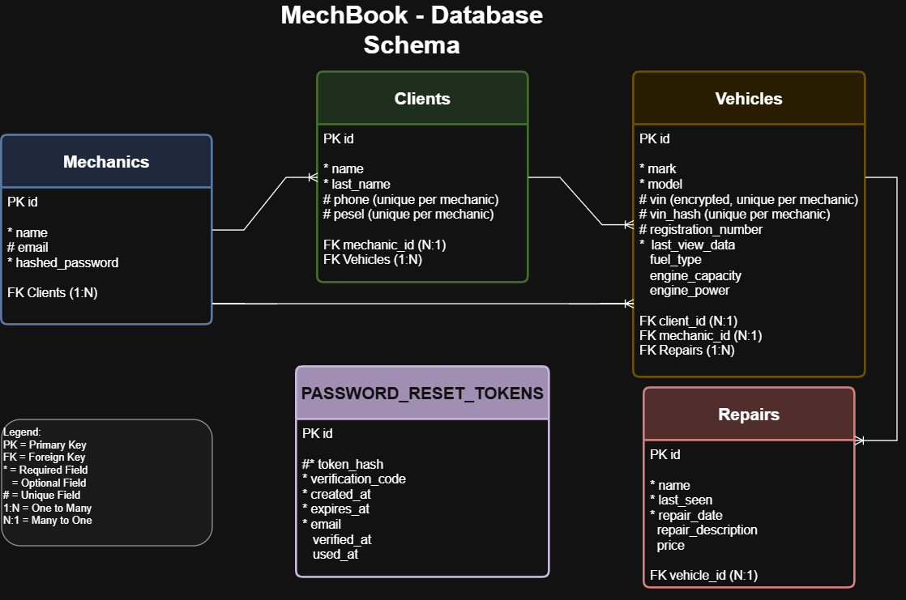
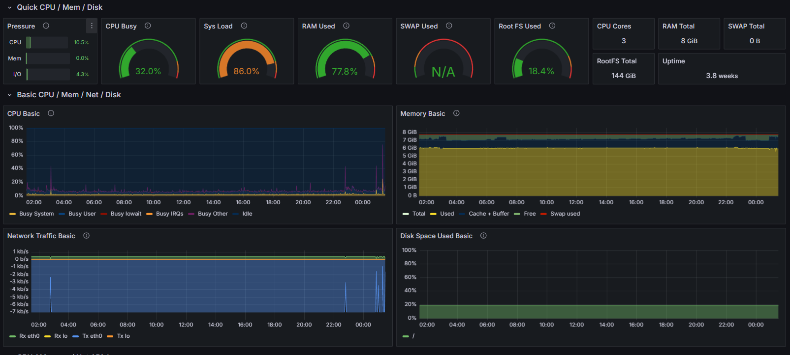
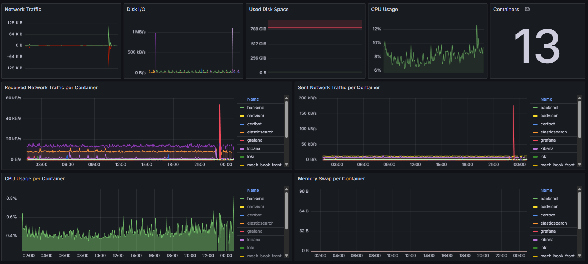

# MechBook

**A comprehensive automotive workshop management system designed for mechanics to efficiently manage clients, vehicles, and repair records.**

## Table of Contents

- [Overview](#overview)
- [Key Features](#key-features)
- [Tech Stack](#tech-stack)
- [Architecture](#architecture)
- [Quick Start](#quick-start)
- [Security Features](#security-features)
- [Multi-Tenancy](#multi-tenancy)
- [Authentication & Authorization](#authentication--authorization)
- [Database Diagram](#database-diagram)
- [API Documentation](#api-documentation)
- [Monitoring & Observability](#monitoring--observability)
## Overview

MechBook is a full-stack application that empowers automotive mechanics to manage their workshop operations efficiently. The system provides a secure, multi-tenant environment where each mechanic can manage their own clients, vehicles, and repair records independently.

### Why MechBook?

- **Secure Multi-Tenancy**: Each mechanic has isolated data space
- **Modern UI**: Intuitive Next.js frontend with responsive design
- **High Performance**: FastAPI backend with optimized database queries
- **Advanced Search**: Fuzzy and fast search across clients and vehicles thanks to Elasticsearch technology
- **Data Privacy**: Encrypted sensitive data (VIN, PESEL)
- **Email Integration**: Password reset with verification codes
- **Docker Ready**: Easy deployment with Docker Compose

## Key Features

### For Mechanics
- **Client Management**: Add, edit, and track client information
- **Vehicle Registry**: Comprehensive vehicle database with technical specifications
- **Repair Tracking**: Detailed repair history and cost management
- **Search & Discovery**: Advanced search across all data
- **Recent Activity**: Quick access to recently viewed vehicles
- **Secure Authentication**: JWT-based auth with password recovery

### Technical Features
- **Multi-Tenant Architecture**: Complete data isolation per mechanic
- **Encrypted Data Storage**: Sensitive information (VIN, PESEL) is encrypted
- **RESTful API**: Well-documented API with comprehensive endpoints
- **Real-time Search**: Elasticsearch-powered search engine
- **Email Notifications**: Automated password reset system
- **Database Backup**: Automated PostgreSQL backup scripts
- **Comprehensive Testing**: Unit and integration tests

## Tech Stack

### Backend
- **Framework**: FastAPI 0.115.14
- **Database**: PostgreSQL with SQLAlchemy ORM
- **Search**: Elasticsearch 8.13.1
- **Authentication**: JWT with secure password hashing
- **Email**: FastAPI-Mail with HTML templates
- **Encryption**: Cryptography library for sensitive data
- **Testing**: Pytest

### Frontend
- **Framework**: Next.js 14 with TypeScript
- **UI Components**: Custom components with Tailwind CSS
- **State Management**: React Context API
- **HTTP Client**: Custom API client with error handling
- **Authentication**: Cookie-based JWT storage

### Infrastructure
- **Containerization**: Docker & Docker Compose
- **Web Server**: Nginx reverse proxy
- **SSL**: Certbot for HTTPS certificates
- **Database**: PostgreSQL with automated backups

## Architecture

### First Steps

1. **Register** a new mechanic account
2. **Login** with your credentials
3. **Add clients** and their vehicles
4. **Log repairs** and track maintenance history
5. **Use search** to quickly find information

## Security Features

### Data Protection
- **Encrypted Storage**: VIN and PESEL data encrypted at rest
- **Secure Hashing**: Passwords hashed with industry-standard algorithms
- **JWT Tokens**: Secure authentication with configurable expiration
- **Input Validation**: Comprehensive data validation and sanitization

### Multi-Tenancy
- **Data Isolation**: Complete separation of mechanic data
- **Unique Constraints**: Per-mechanic uniqueness for sensitive fields
- **Access Control**: Automatic filtering based on authenticated user
- **Privacy**: No cross-mechanic data leakage

### Authentication & Authorization
- **Password Recovery**: Secure 3-step password reset process
- **Email Verification**: 6-digit codes with 15-minute expiration
- **Session Management**: Secure cookie-based sessions
- **Token Security**: Hashed tokens with proper expiration

## Database Diagram

## API Documentation

### Complete API Reference
- **Detailed Documentation**: [API Documentation](./backend/API_DOC.md)

## Monitoring & Observability

The project includes a complete observability stack for production-ready monitoring and troubleshooting:

### Monitoring Stack

- **Prometheus**: Metrics collection and time-series storage
- **Grafana**: Visualization dashboards and analytics
- **Loki**: Centralized log aggregation
- **Promtail**: Log shipper for Docker containers
- **cAdvisor**: Container resource metrics
- **Node Exporter**: Host system metrics

### Key Features

- **Application Metrics**: FastAPI exposes Prometheus metrics at `/metrics` endpoint (request rates, latency, error rates)
- **System Monitoring**: Real-time CPU, memory, disk, and network metrics for all containers
- **Log Aggregation**: Centralized logging with container-level filtering and search
- **Dashboards**: Grafana dashboards for application performance and system resources
- **Production Ready**: All monitoring services containerized and integrated with Docker Compose

### Grafana Dashboard Screenshots

*Figure 1: Application performance metrics and request statistics*

*Figure 2: System resources and container monitoring*

